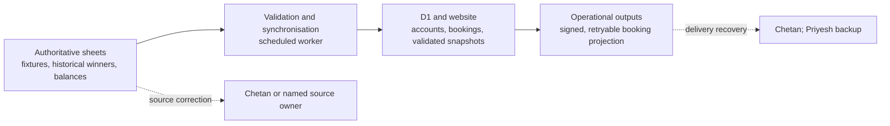

# Jaguar Golf Society operations handover

This guide is for Priyesh, Chetan and future committee volunteers. The website administrator area contains the live **Operations** view. It is the only website screen that may return approved restricted workbook links, and those links are sent only after the server confirms the signed-in user is an administrator.

## The rule that prevents split ownership

D1 is canonical for accounts, sessions, website bookings, booking audit and delivery state. A spreadsheet is authoritative only for the named source role below. Booking changes move one way from the website and D1 into the approved booking-output workbook; editing that workbook never edits a website booking.

## Source register for routine operation

| Source | Purpose and normal use | Owner | Direction | Current state |
| --- | --- | --- | --- | --- |
| `Jaguar_Golf_Society_QA_Compliance_Matrix` / `DB_Fixtures` | Approved fixture identity, event details, status and exact registration/cancellation inputs | Chetan / committee fixture owner | Sheet → validation → D1/website | Verified; invalid or incomplete rows fail closed |
| `Jaguar_Golf_Society_QA_Compliance_Matrix` / `DB_Leaderboards` | Historical Hall of Fame winners in the four existing categories | Specific committee maintainer unresolved | Sheet → validated D1 snapshot → public Hall of Fame | Verified source; current-points/ranks are not in scope |
| `JGS_Members_Balance` / `Sheet1` | Read-only per-member balance and reconciliation input | Chetan | Sheet → per-member portal calculation | Verified; complete rows never go to the browser |
| `JGS Booking Management` / `Bookings` and `Sync Log` | Restricted operational projection and delivery evidence | Chetan; Priyesh is recovery backup | D1 outbox → signed adapter → workbook | Local implementation complete; external deployment gated |
| `Players_Specific_URLs` / `Sheet1` | Restricted directory of member finance links | Owner and authority unresolved | Reference-only until approved | Do not automate or match by display name |
| Other member-portal sheets | No approved role yet | Unresolved | None assigned | Do not add speculative links |

The direct links are provider-owned configuration, not source code. Their server settings are `FIXTURES_WORKBOOK_URL`, `LEADERBOARDS_WORKBOOK_URL`, `MEMBER_BALANCES_WORKBOOK_URL`, `BOOKING_MANAGEMENT_WORKBOOK_URL` and `MEMBER_FINANCE_LINKS_WORKBOOK_URL`. Do not place their real values in Git, chat, screenshots, public assets or client-side environment variables.

## Routine checks

1. Open **Admin → Operations** and confirm every expected source is labelled as verified, unresolved or unavailable. Do not guess a missing owner or link.
2. Open **Admin → Sync status** after source changes. Fixture and Hall of Fame runs should be healthy; a failed run must leave the previous valid data intact.
3. Check booking-output pending and failed counts. Escalate after three attempts or fifteen unresolved minutes.
4. Before expecting registration to open, confirm the fixture source has exact approved registration-open, registration-close and cancellation-close values. Missing or invalid values intentionally keep booking closed.
5. Open restricted workbooks only from the administrator view and confirm Google access is no broader than the committee intends.
6. Never create replacement production members, bookings or sheet rows to make a check appear successful.

## Interpreting and recovering from failures

### Fixture source

Correct the named row in `DB_Fixtures`, preserving its stable fixture ID, then run fixture synchronisation again. Missing, duplicate, unexpected or invalid records remain draft/unbookable. Do not patch the D1 event row directly.

### Historical Hall of Fame

Correct `DB_Leaderboards` and rerun or await the scheduled worker. The importer validates the full generation before switching it live, so a bad source row must not erase the previous valid Hall of Fame.

### Booking output

Review the restricted `Sync Log`, adapter deployment and protected Cloudflare settings. Resolve a formula collision or adapter fault, then use the administrator retry control. Do not delete workbook rows or D1 bookings. Dietary data remains excluded.

### Member balances

Check the reconciliation date cell and confirm that one normalised member identity matches one source row. Duplicate or missing matches fail safely. Never download or expose the full balance sheet to diagnose a member-facing issue.

### Authentication, D1 or deployment

Preserve the active deployment and record the affected commit. Before a remote D1 migration, export the database and record the rollback point. Priyesh owns technical recovery; any account, member-data, DNS, sharing or production-booking mutation requires the relevant authority.

## Stop-and-ask gates

- Exact future fixture windows, capacity behaviour and a non-empty `BookingFields` contract.
- Production member onboarding and one authorised real member acceptance identity.
- Google Apps Script owner authorisation, protected secret/URL entry and workbook sharing.
- Remote D1 migration, Worker/Pages deployment, DNS/domain changes or production rollback.
- Ownership and authority for `Players_Specific_URLs` and any other member-portal source.

Never paste a secret, provider identifier, database identifier, private workbook URL or member row into chat. Use the provider’s masked secret controls and the administrator dashboard’s protected links.
